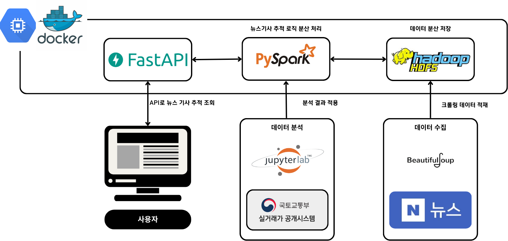

# BDP-Project-Team9: 부동산 매매가 변동 원인 뉴스 추적 시스템
> 부동산 실거래 데이터를 인터넷 뉴스 기사와 연계하여 시장 변화의 원인을 분석

## 프로젝트 개요
부동산 전월세 및 매매가 데이터를 부동산 뉴스와 연계하여 매매가 변화 원인을 분석하고, 변화 원인으로 예상되는 뉴스기사를 추적하여 제공하는 시스템.   
부동산 데이터를 시간(+지역) 단위로 분석하고, 매매가 및 전월세가 변동의 원인으로 추측이 되는 상위 3개(or 5개) 뉴스들의 헤더라인을 표시

## 목표
- 부동산 데이터(아파트 매매/전월세)를 월 단위로 분석
- 부동산 기사와 결합하여 아파트 가격 변동의 주요 원인(정책)을 추측
- 정책 별 가격 변동에 영향을 주는 기간을 분석
- 사용자가 날짜를 입력하면 해당 월의 아파트 가격 변동과 관련있는 정책과 관련된 상위 뉴스 기사를 추적 연결

## 협업 방법
- HDFS를 사용하여 데이터 관리를 수행하고, 공용 gcp 인스턴스을 활용해 협업 환경에서 데이터 처리 및 코딩 작업을 진행 
- 서로의 진행 상태를 실시간으로 확인 할 수 있으며, 데이터 및 코드 공유의 불편함을 최소화하
- 완성된 코드의 기록용으로 깃허브 레포지토리 활용 
    - https://github.com/mju-bigdataprograming-team9/BDP-Project-Team9.git

## 시스템 아키텍처

- BeautifulSoup 라이브러리를 이용하여 크롤링한 5년치의 네이버 뉴스기사는 hdfs에 저장
- 이를 사용하여 부동산 실거래 데이터와 뉴스기사의 연관성을 분석
- 분석 결과를 뉴스기사 추적 로직에 반영. 실제 분석 및 대량의 뉴스 기사들 사이에서 원하는 뉴스기사를 빠르게 가져오기 위해서 분산 처리가 필요했기 때문에 pyspark를 적용
- 마지막으로 사용자가 직접 기간을 입력하고 결과를 확인 하는 것은 빠른 개발 및 swagger 등 여러 편의성 갖춘 fast api 채택하여 사용

## 가정 및 제한 사항
- 부동산 기사는 부동산과 관련된 정책을 포함
- 해당 월에 가장 많은(영향력 있는) 정책은 집값에 영향을 미침
- 어떠한 정책이 집값에 어떻게 영향을 미치는지는 고려하지 않음

## 팀원 구성 및 역할
| 60191685 정동준 | 60201670 남태욱 | 60201685 신윤철 | 60211673 신유빈 | 60211690 이한결 |
|---------|---------|---------|---------|---------| 
| 뉴스 기사 크롤링 | 실행 환경 구성  | 부동산 데이터 전처리, 분석 | tf-idf 분석 | count 기사별 정책 분류 |
| 뉴스 기사 추적 API 구현 | count 월별 정책 분류 | 정책 단어 라벨링 | 발표 | count 기사별 정책 분류 |
|  |  | 월별 정책 매핑 |  |  |
|  |  | 최종 결과 도출 |  |  |

 
		
		
## 사용 데이터
-	부동산 실거래 데이터: 국토교통부 실거래가 공개시스템
https://rt.molit.go.kr/pt/xls/xls.do?&mobileAt=
-	경제/정책 뉴스 데이터: 네이버 뉴스 웹크롤링

## 한계점
|||
|:---------:|:---------|
| 데이터 부족 | 짧은 기간(1~6개월)에 초점이 맞춰져 있어, 정책의 장기적 영향을 평가하기 어려움 |
| 지역별 차이 미고려 | 서울시에 한정된 데이터를 사용하였기에 전국의 부동산 가격을 고려하기엔 부족함이 있었으며, 서울 내에서도 세부적인 지역 간의 차이를 고려하지 못함 |
| 정책간 독립성 부족 | 정책 간 상호작용 효과 반영하지 못함 |
| 정책 외 다양한 요인 고려하지 함 | 경제 성장률, 금리 등 외생변수 고려하지 못함 |

## 향후 연구 과제
|||
|:---------:|:---------|
| 장기적 분석 | 정책 시행 후 최소 12개월~24개월의 장기 데이터를 분석하여    정책 효과의 지속성 및 시차 효과를 평가. |
| 정책 간 상호작용 분석 | 다중 회귀 분석 또는 인과관계를 모델링하여 각 정책이 개별적으로 또는 조합으로 어떻게 작용했는지 파악. |
| 머신러닝 적용 | 예측 모델(Random Forest, XGBOOST)를 활용하여 정책     효과를 예측하고,  변수의 중요도를 평가 |
| 정책의 효과를 다방면으로 분석 |변동률과 더불어 금리, 물가 상승률 등 다른 지표와 통합 분석. 이를 통해 부동산 시장 변화뿐 아니라, 정책이 경제 전반에 미친 영향을 통합적으로 분석 |

